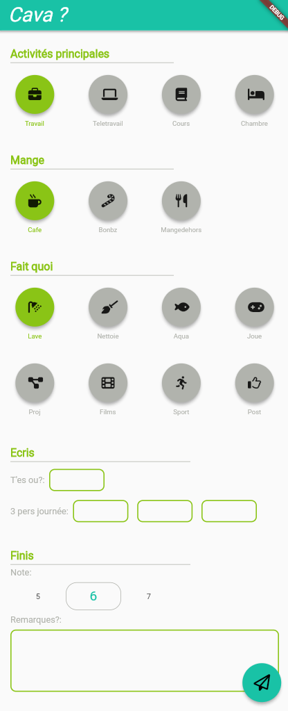

**Projet en développement; cet article est donc probablement incomplet**

## Origine
Porté par [cet article de samplesize]("https://samplesize.one/blog/posts/my_year_in_data/"), je me suis tout de suite interessé à cet exercice.
Chaque jour, répondre à des questions, enregistrer ces données puis les analyser m'a tout de suite parlé. Enregistrer sa vie, tout en le faisant plus vite et simplement qu'un journal intime m'a plu.

## Concept
Pour valider mon concept, je me suis lancé dans la création d'un petit script Python.
Tout les matins, je lancerais donc le script, et réponderais à quelques questions à propos du jour précédent, que j'ai prédéfinies :
- Est ce que j'ai travaillé ?
- Est ce que j'ai pris du café ?
- Est ce que j'ai regardé un film ?
- etc...
- Quelles ont été les 3 personnes de la journée ?
- Un note sur 5
- Une remarque sur la journée

Le script enregistre ensuite les données dans un fichier CSV, stocké sur un dépot privé Github.

J'ai utilisé ce script pendant quelques mois, et ait donc récolté beaucoup de données.

### Problèmes
Avec ce concept, j'ai vite rencontré quelques problèmes, plus ou moins dérangeants :
- Le script python fonctionne bien mais n'est pas très pratique. J'utilise une application qui me permet de le faire tourner sur mon téléphone, mais l'interface en lignes de commandes est assez austère.
- Pour modifier certaines parties du scripts, ou plus simplement ajouter des questions, il faut modifier tout le script.
- Le stockage du script sur GitHub rend les données accessibles n'importe où, mais l'utilisation de l'API n'est pas sécurisée et plus généralement pas pratique.
- Actuellement, je n'ai aucune manière d'analyser ces données.

## Applications
Pour résoudre ces problèmes, et rendre le projet bien mieux fini, j'ai décidé de créer une application mobile.

### Cahier des charges
- Utiliser Flutter
- Les questions peuvent être modifiées/ajoutées/supprimées
- Sauvegarde des données sur GitHub, Drive, DropBox ou en locale
- Une notification doit être envoyée chaque matin pour ajouter les données
- Thèmes

### Dev

## Analyse des résultats