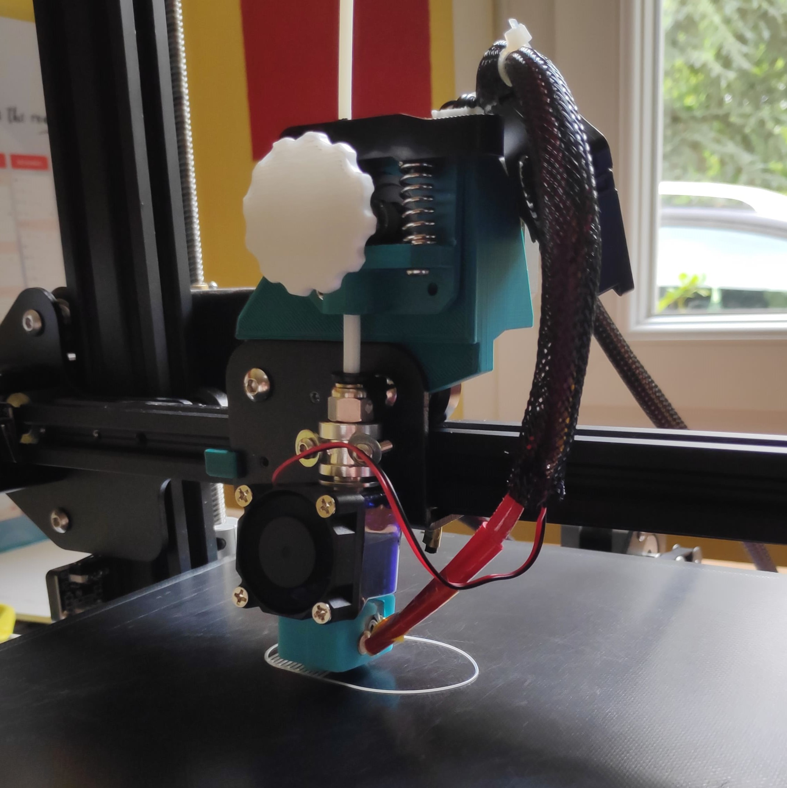
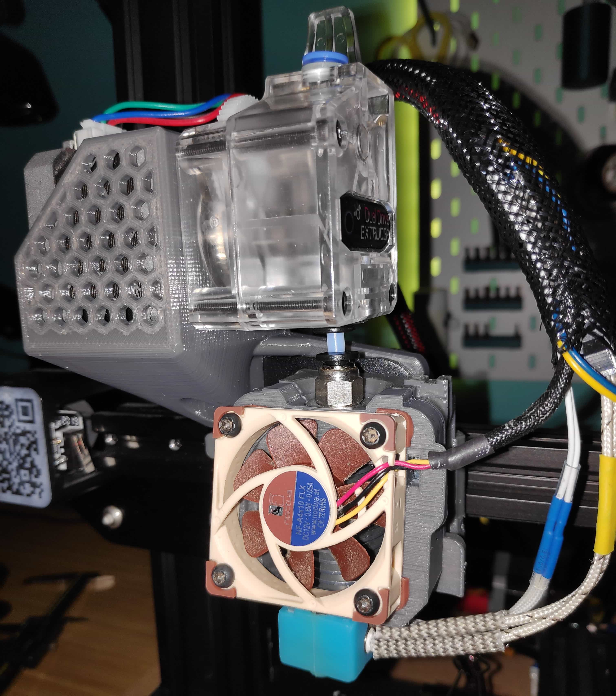
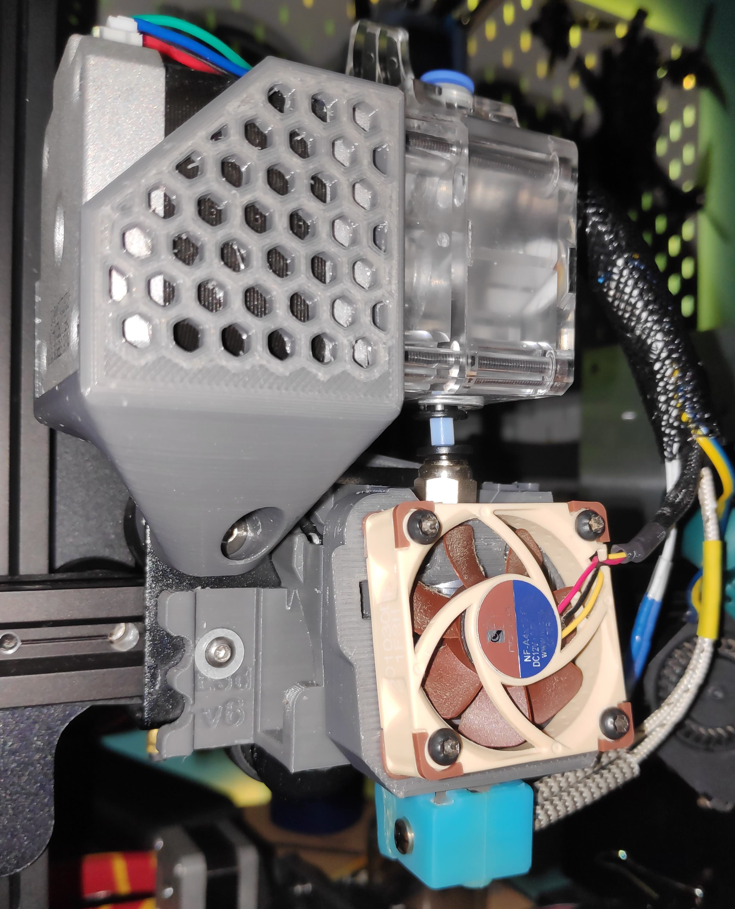
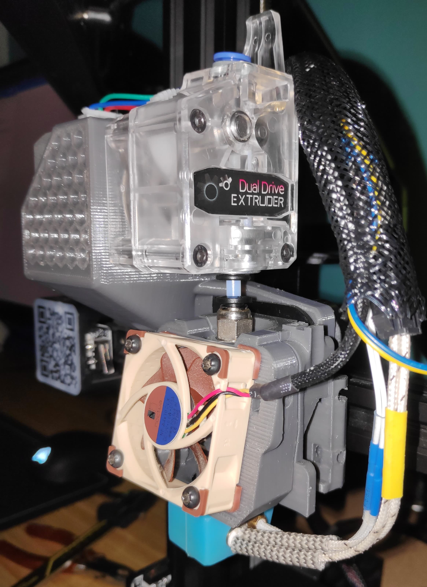
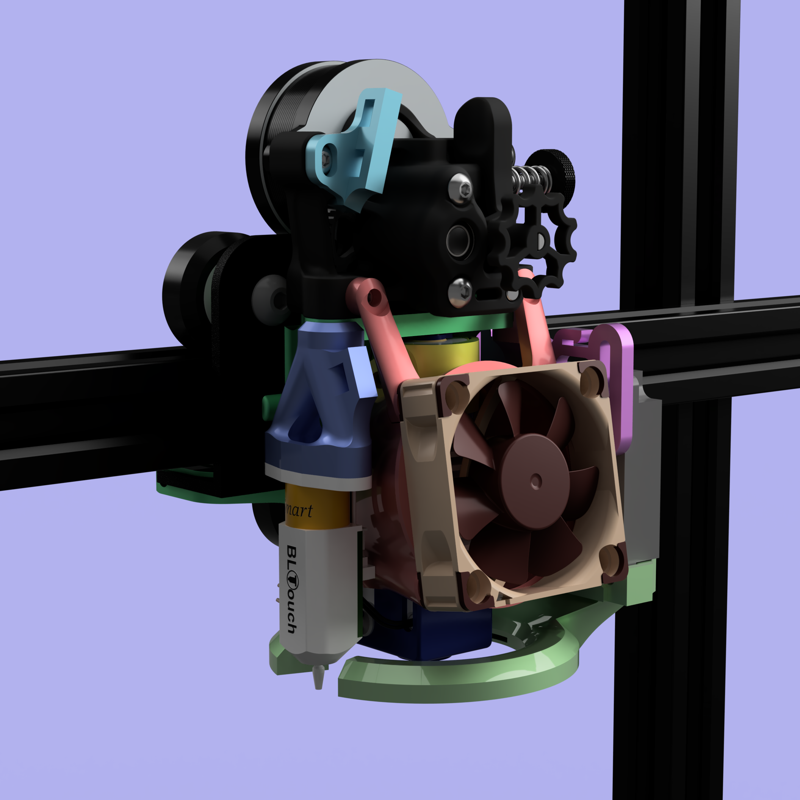
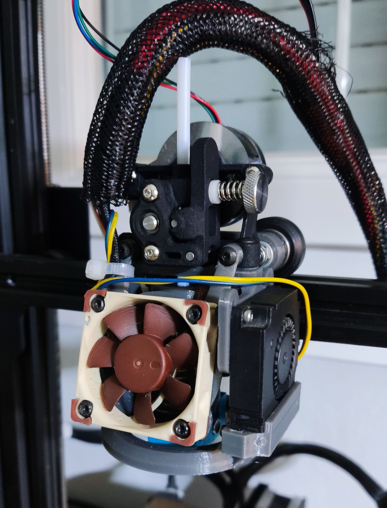
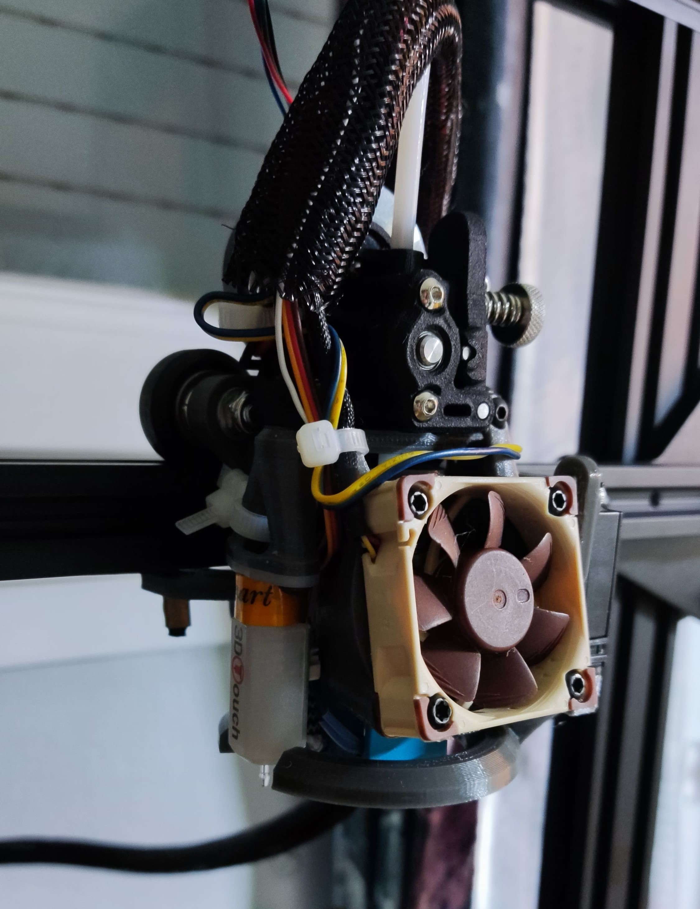

**Projet en développement; cet article est donc probablement incomplet**

## Historique
Lors d'un destockage chez LDLC, j'ai pu acheter des bobines de filaments ABS pour, de 1 à 3€. 
Le seul problème est que ce filament était au diamètre 2.85mm, alors que le diamètre plus commun est de 1.75mm.

J'avais donc du bon filament, mais incompatible avec mon extrudeur et ma hotend, c'est pour cela que j'ai essayé de créer mon propre système d'extrudeur.

### V1
Ma V1 relevait plus du concept que d'un vrai design.

J'ai passé beaucoup de temps à créer un design basé sur l'extrudeur de base de la Ender 3, mais malheuresement je n'arrivais pas à obtenir assez de force de l'extrudeur pour gérer efficacement les rétractations.

J'ai donc acheté un clone d'un extrudeur BMG et me suis mis au travail pour une v2.

### V2
La v2 était beaucoup mieux. Avec, je pouvais faire des impressions convenables, même si le design en lui-même était encore loin d'être fini.

### V3

### V4
A partir de cette version, le fait d'utiliser le filament 2.85mm s'est un peu essoufflé, et je suis plutôt resté sur l'idée de créer mon propre kit que vraiment de créer un kit pour du filament 2.85mm.

Cette fois-ci, je suis parti sur l'extrudeur open source [Sherpa Mini](https://github.com/Annex-Engineering/Sherpa_Mini-Extruder). 
Il est très puissant, compact et ultra léger.

Pas convaincu du chariot par défaut de l'Ender 3, je me suis donc mis à l'idée de créer le mien en impression 3D.

Enfin, j'ai voulu utiliser des connecteurs à ressorts pour pouvoir changer rapidement et facilement de hotend.

J'ai donc désigné ceci :

Et le design fonctionnait bien ! Le système de hotend interchangeable était parfaitement fonctionnel et le tout était très efficace.

Malheuresement j'ai souligné quelques points qui empechait toute utilisation quotidienne de ce système:
- Le chariot imprimé en 3D, malgré avoir été épaissit et imprimé en PETG, n'était absolument pas rigide. Il y a tant de forces sur le chariot que le tout était légerement flexible et donc inutilisable sur le long terme.
- Le système de hotend interchangeable était très bon mais... au final il ne sert à rien. On ne peut mettre q'un type de hotend, ce qui revient au même.
- Le système de refroidissement n'est pas efficace, surtout au niveau de la buse.

## V5

### Composants

### Design