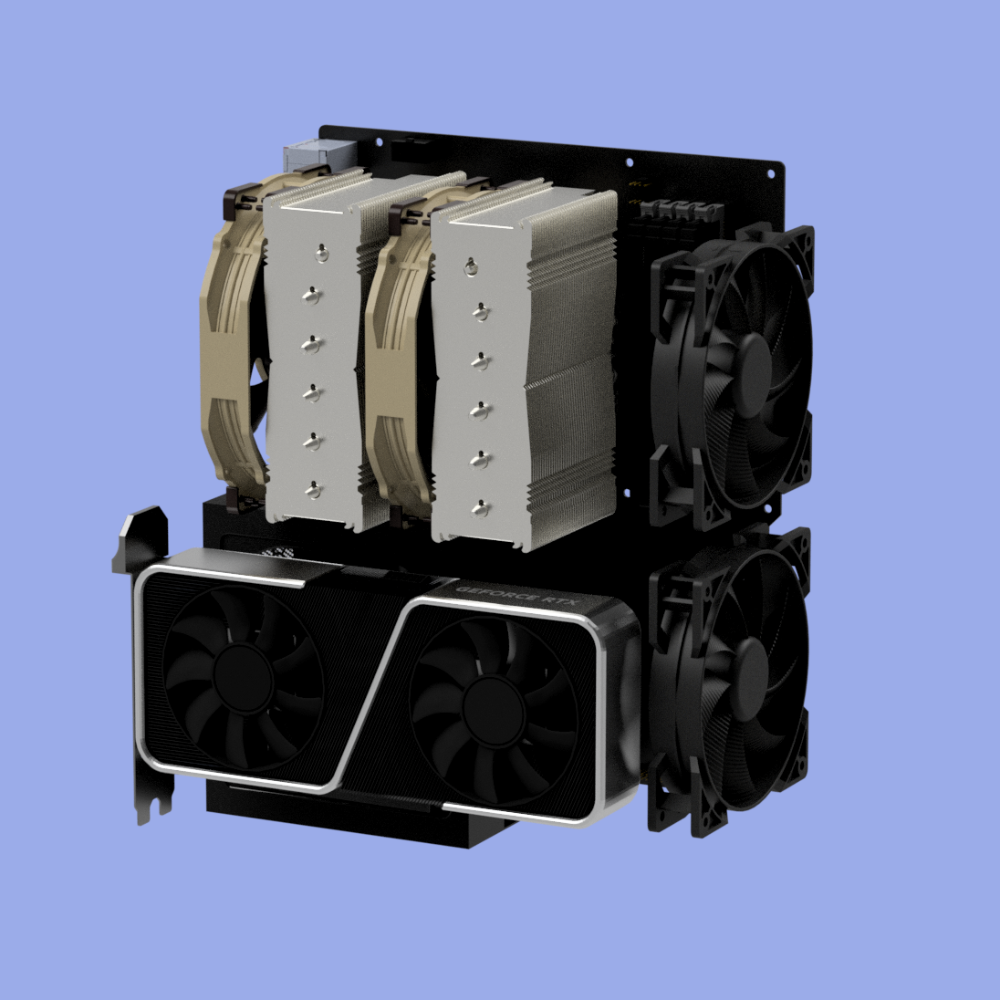
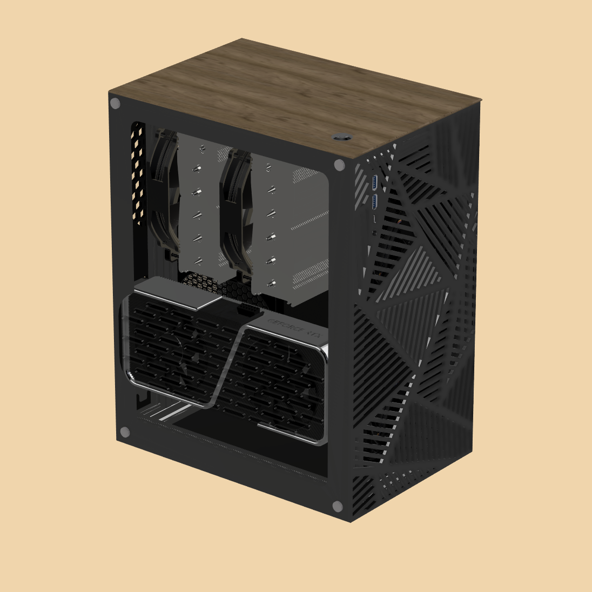
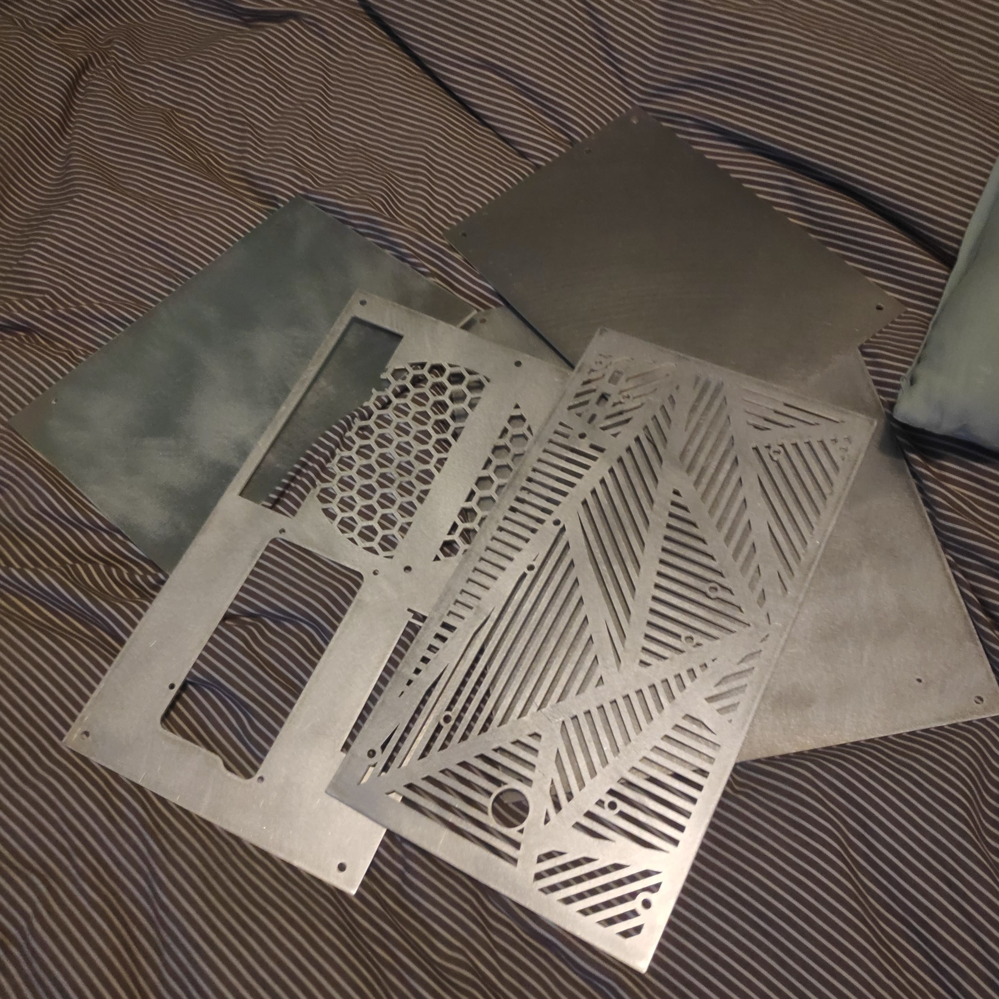
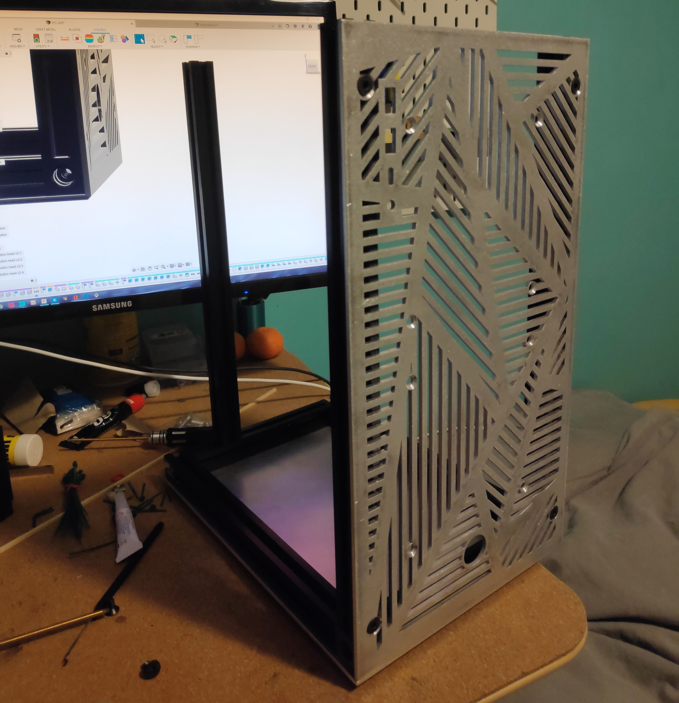
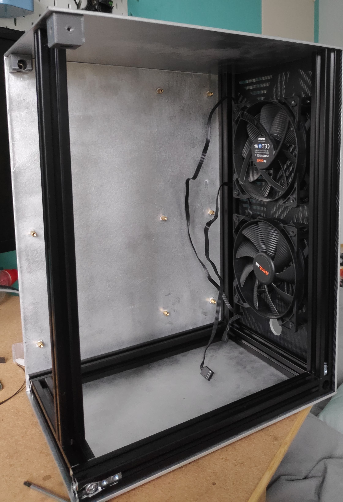
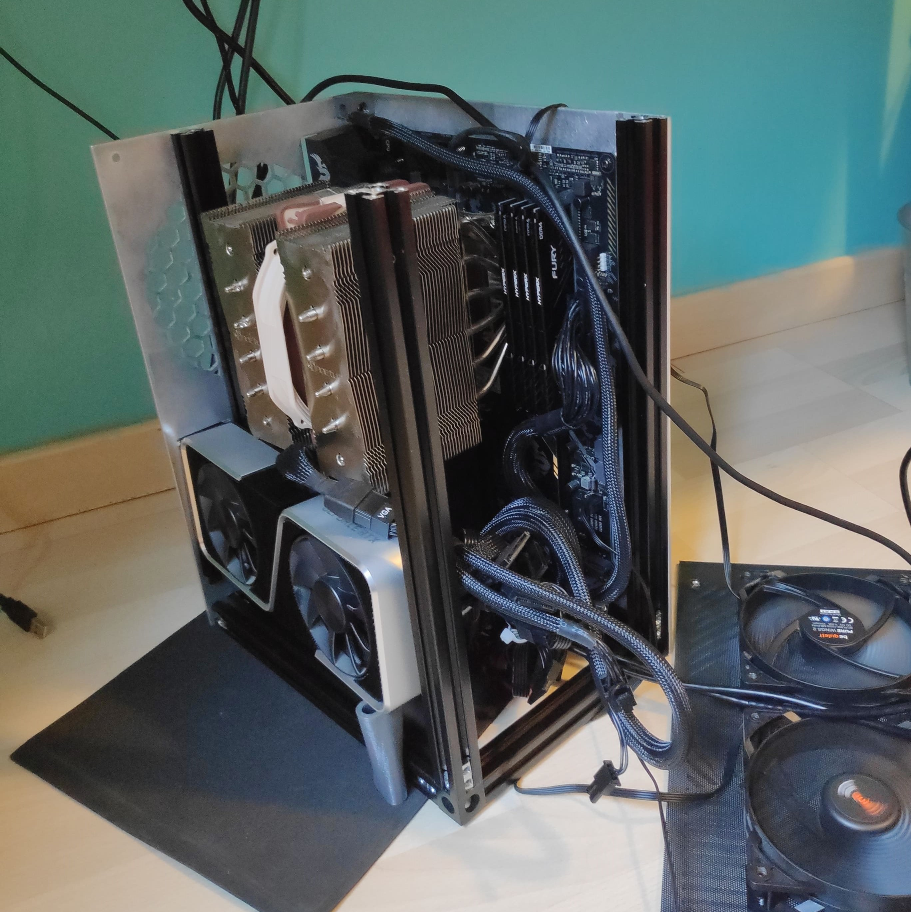
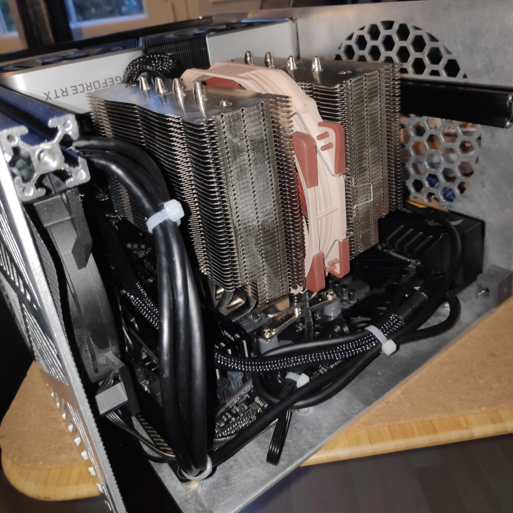
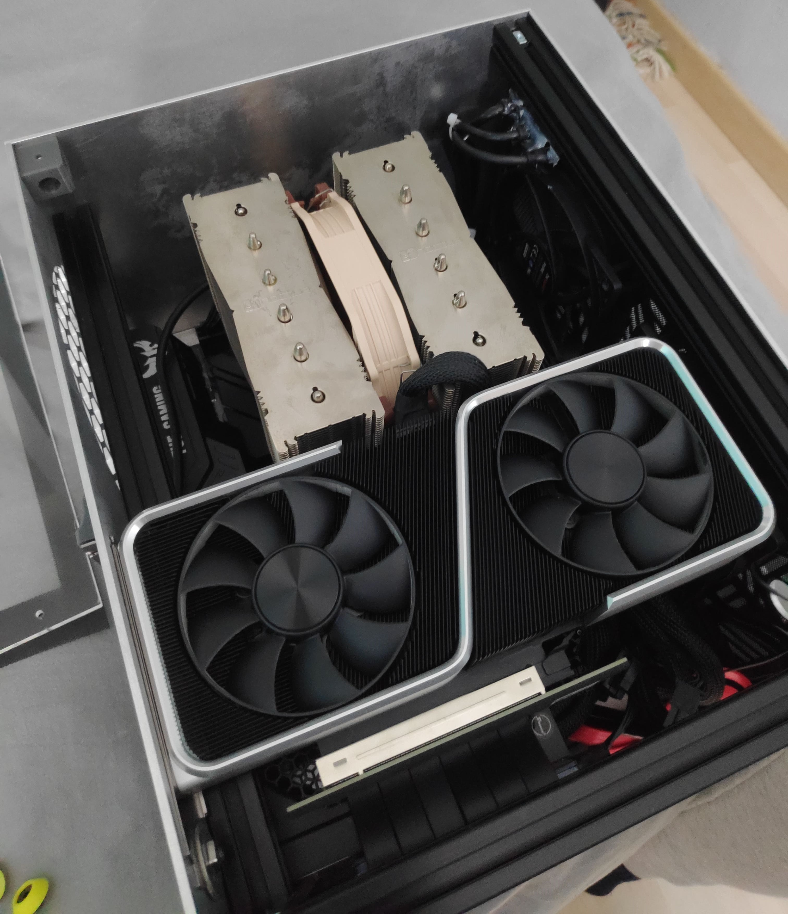
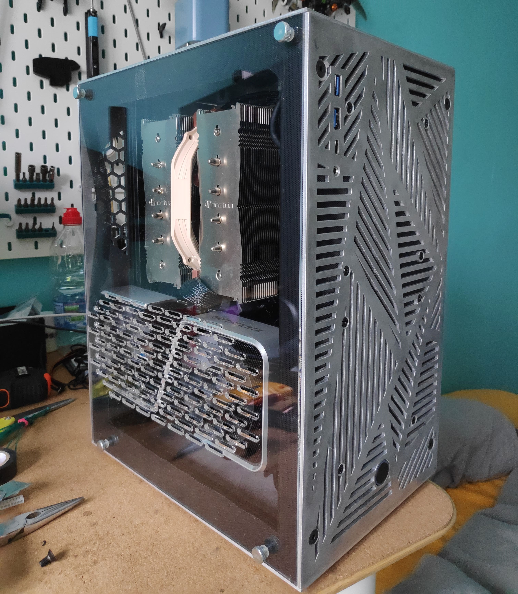

Début 2021, je me suis pris de passion pour le [subreddit SFFPC](https://www.reddit.com/r/sffpc/).
A cette époque, je venais d'avoir mon premier pc fixe, mais le boitier (que j'avais choisi pour son prix) ne me convenais pas à 100%. Pourquoi pas m'en faire un moi-même ?

## Design
### Cahier des charges
A ce moment là, je n'avais pas encore mon imprimante 3d, donc je n'avais quasiment pas fait de design CAD (à part quelques modèles de test).
J'ai donc lancé Fusion 360 et commencé à réfléchir au design global. Mon cahier des charges était assez simple :
- Seulement utiliser mes composants actuels, tous au format ATX, càd au format taille 'complète'
- Malgré la taille des composants, le volume du boitier devait être le plus bas possible. 
- Utiliser des matériaux faciles à trouver, pas cher, et faciles à travailler et monter.

### Composants
La 1ère étape à été l'une des plus longues: trouver les fichiers 3d de mes composants.

Pour certains composants, comme le ventirad ou les ventilateurs, c'est facile. Composants de quelques années, très connus, facile à trouver.

Pour certains autres, il à fallu beaucoup plus chercher. Par exemple la carte graphique est une RTX 3060ti, à ce moment elle était sortie depuis 3 mois. Cela à été très long mais un modèle 3d à finalement pu être trouvé.

Enfin, la carte mère et l'alimentation on dû être réalisé à la main.

Après un peu de recharche, je suis arrivé à un agencement qui me parraissait plutôt correct. Cet agencement est arbitraire et sera modifié tout au long du design.

### Matériaux
Pour le choix des matériaux, et plus globalement du type de structure que je vais utiliser, je suis parti sur des extrusions aluminium pour la structure et des panneaux pour compléter le tout.
Les panneaux sont de matériaux assez solides, le choix de base était aluminium, acier, boix ou fibre de carbone. Au final, ce sera l'aluminium qui sera choisi pour son faible coût de fabrication.
Un panneau latérale sera en plexiglas pour permettre de voir l'intérieur du PC.

### 1er design
Le 1er design était comme tel:

Ce design était dans l'ensemble plutôt réussi, mais dans les détails très fouilli. Etant mon 1er gros design CAD, ma méthode était mauvaise et très difficile à modifier, aucune visserie n'était installée, les composants pas bons.
Néanmoins les grandes idées étaient les bonnes: agencement, structure, design de l'avant et coté.
J'ai donc tout repris de zéro sur un nouveau design

### 2ème design
Mon second design fut le bon.

Malgré quelques accrochages, tout était correct. Maintenant, il fallait trouver toutes les pièces, et le monter...

### Améliorations
Mon design à été amélioré au fur et à mesure plusieurs fois, pour ajouter et/ou améliorer des aspects du boitier.

Récemment un filtre à poussière changeable à été ajouté (même si celui ci rélève plus du test que du produit fini).

## Montage
1 an après, j'ai enfin acheté et reçu toutes les pièces pour le montage.

